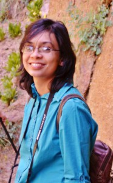

<figure style="width: 186px;">

<figcaption >Me at Zion National Park</figcaption>
</figure> 
 

I was born in Dhaka, Bangladesh. In my country, there is no specific rule about a person&#8217;s name, and so, although my name first name is Somaia, I usually go by my last name Sylvia, which in fact is not my family name. You can call me Sylvia, too.

My father is a Marine Engineer and so I was brought up in the beautiful port city of Chittagong, Bangladesh. After finishing high school in Chittagong, I went to Dhaka for my Undergrad studies in Bangladesh University of Engineering and Technology (BUET), from where I got my MSc degree as well. Before coming to the USA for PhD, I also served as a lecturer for about 2 years in BUET.

I am very passionate about photography. Sometimes I think to myself, I could have done better as a photographer than I am now as an engineer :wink:. I love doing portrait photography very much. Night landscape is my another favorite subject. I also love listening to music. No matter what I am doing, I would probably enjoy a music if it matches with my taste. And yes, I love cooking too, but only the food that I myself like to eat :smile:!
